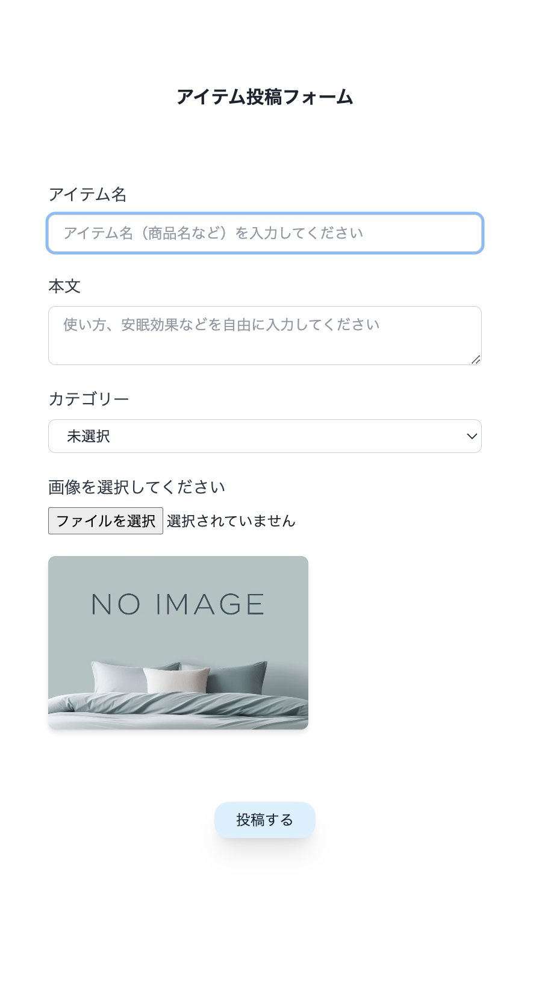
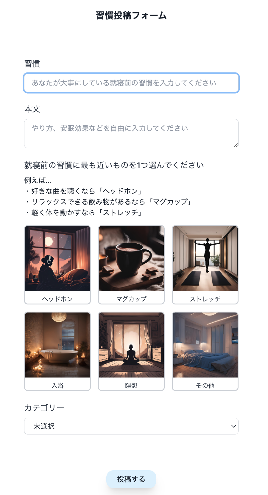
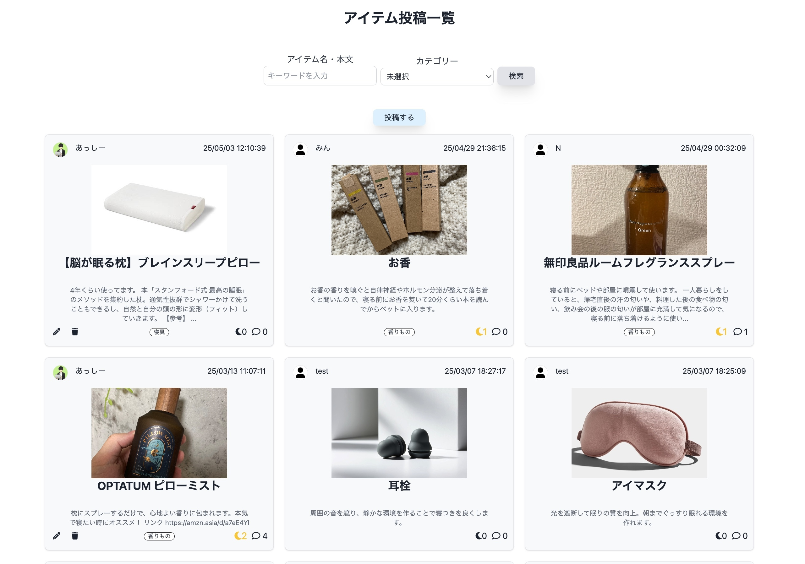
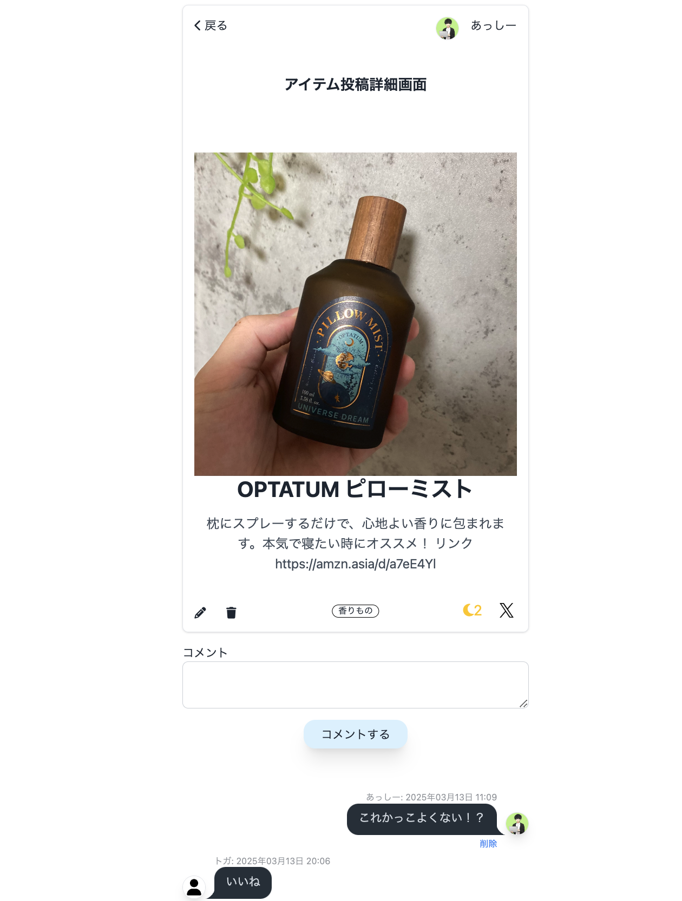
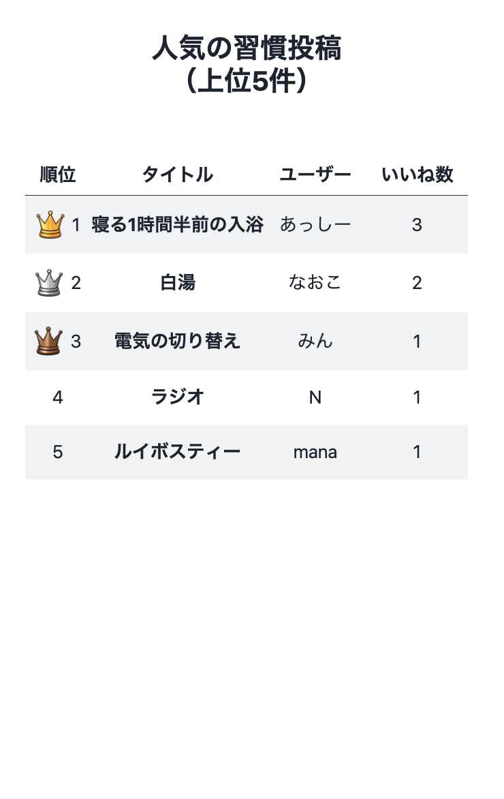
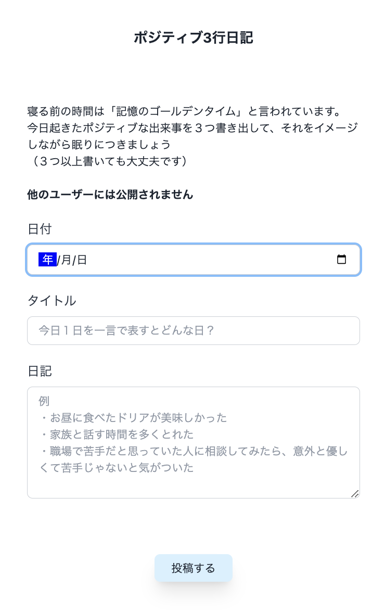
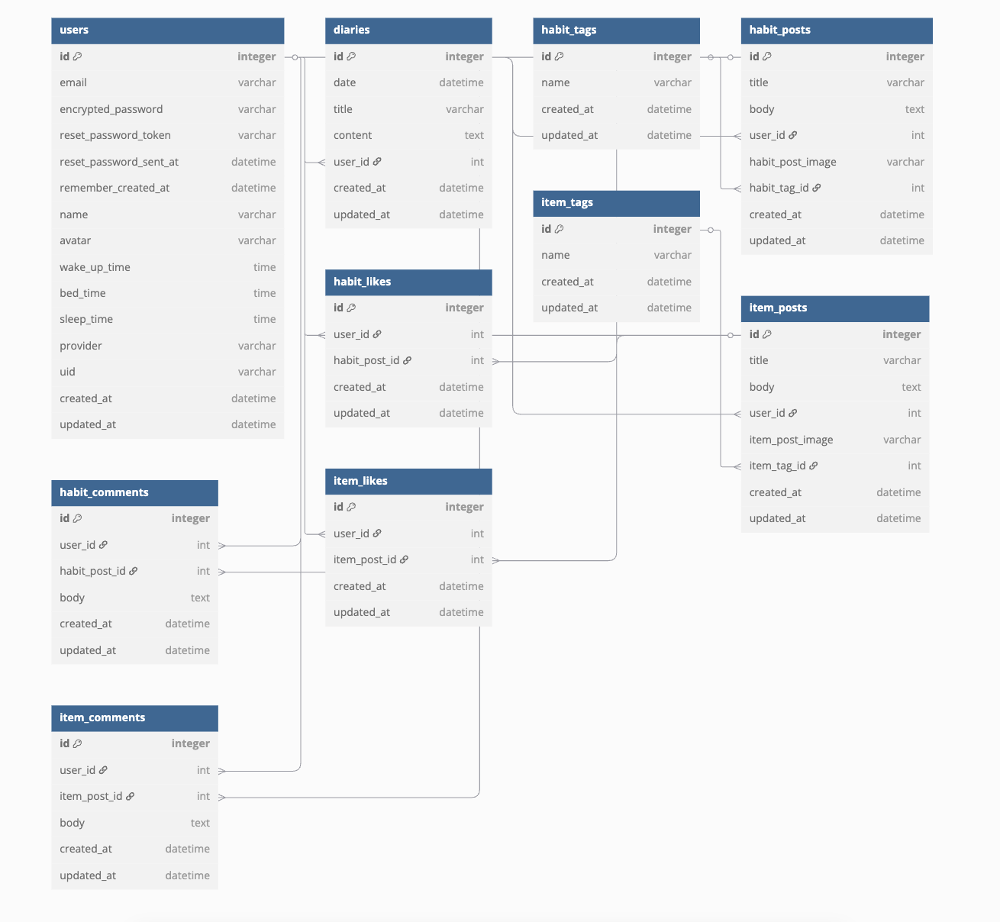

# Good Sleep Joy
### URL：[Good Sleep Joy](https://good-sleep-joy.com/) 

<!-- ここに画像を書く -->

## 目次
- [サービス概要](#サービス概要)
- [このサービスへの思い・作りたい理由](#このサービスへの思い・作りたい理由)
- [ユーザー層について](#ユーザー層について)
- [サービスの利用イメージ](#サービスの利用イメージ)
- [ユーザーの獲得について](#ユーザーの獲得について)
- [サービスの差別化ポイント・推しポイント](#サービスの差別化ポイント・推しポイント)
- [機能](#機能)
- [使用技術](#使用技術)
- [画面遷移図](#画面遷移図)
- [ER図](#er図)

## サービス概要
「良い眠り」から「喜び」を感じていただく、睡眠サポートアプリです。 
ユーザー同士が、質の高い睡眠をとるために使っているアイテムや、普段から行っている習慣を共有できます。 
また、1日の最後にその日楽しかった出来事を3つ書き出すことで、毎日ポジティブな気持ちで眠りにつくことができます。 

## このサービスへの思い・作りたい理由
自分自身、１日７〜８時間の睡眠時間の確保を心がけており、一般的に必要とされる睡眠時間を確保できていました。 
しかし、以下のような問題がありました。

**・目覚めがスッキリしない** 
**・起床後に疲れが残っていると感じることが多い** 
**・日中の眠気** 
**・昼間や午後に強い眠気を感じることがあり、集中力が続きにくい場面がある** 

また、まれにですが、ほとんど寝ること（入眠）ができず、非常に質の低い睡眠で翌日を迎えることがありました。

そこで、質の高い睡眠や入眠へ興味を持つようになり、毎日寝る前はリラックスして過ごすこと、ポジティブな気持ちで眠りにつくことが重要だと感じました。 
マットレスや枕といった寝具にもこだわりをもち、ピローミストやアイマスクといった睡眠アイテムも使用するようになりました。

上記の経験から、「質の高い睡眠」は単に睡眠時間の長さではなく、ベッドに入るまでのプロセスや、寝具・アイテムの工夫によって大きく左右されることを実感しました。

自分の周りでも、睡眠に関して何かしらの問題を抱えている人は多いのではないかと感じております。 
人生の3分の1を占める睡眠が上手くいけば、日中のパフォーマンスも上がり、人生そのものが上手くいくと思います。 
ユーザー同士が使っているアイテムや、普段から行っている習慣を共有し合い、睡眠が楽しい時間になるように、サポートする場を提供できたらと考えております。 

## ユーザー層について
質の高い睡眠に興味ある人が対象となります。（年齢性別などは問いません） 
※何日も寝れないなどの重症の場合は、専門的な対処が必要であると考えられるため対象としません。

## サービスの利用イメージ
|アイテム投稿画面|習慣投稿画面|
|:-:|:-:|
|||
|ユーザーは、自身が使っている睡眠関連アイテムを写真付きで投稿します。使い方や安眠効果も同時に投稿できます。アイテムは、枕、マットレス、お香、入浴剤など、自身が質の良い睡眠につながっていると感じている物なら可能です。|ユーザーは、自身が行なっている就寝前の習慣を投稿します。実施の方法や安眠効果も同時に投稿できます。アイテムとは異なり写真の投稿ではなく、６つ程度アイコンを用意し、いずれかを選択して投稿できる仕組みとなっております。|

|アイテム投稿一覧画面|習慣投稿一覧画面|
|:-:|:-:|
|||
|ユーザーが投稿したアイテム投稿一覧画面です。アイテム名・本文、カテゴリーで投稿の検索ができます。いいねを押すことができます。|ユーザーが投稿した習慣投稿一覧画面です。習慣名・本文、カテゴリーで投稿の検索ができます。いいねを押すことができます。|

|投稿詳細画面 （アイテム/習慣）|マイページ|
|:-:|:-:|
|||
|投稿一覧画面から投稿を選フ択すると、詳細情報を確認できます。投稿の編集・削除、Xへの共有、いいね、コメントができます。 ※未ログイン時は、投稿の詳細画面を閲覧することのみ可能です。|プロフィールの設定が可能です。また、いいねした投稿一覧、日記一覧が表示されます。過去に書き出した日記を遡ることができるので、日々の生活が「ポジティブ」に溢れていることに気づきます。|

|人気の投稿 （アイテム/習慣）|3行ポジティブ日記投稿画面|
|:-:|:-:|
|||
|いいねの数を集計し、人気の投稿上位5件を確認することができます。タイトルをクリックすると投稿詳細画面に遷移するため、新しい発見やアイデアの参考にすることができます。|その日あった「嬉しかったこと」「楽しかったこと」など、良かった出来事を3つ書き出すことができます。よって、ポジティブな気持ちで1日を終えられ、スムーズな入眠を促します。|

## ユーザーの獲得について
- SNS(XやInstagram)での周知 
- プログラミングスクールの仲間への宣伝 
- 学生時代の友人や知人への宣伝

## サービスの差別化ポイント・推しポイント
一般的なSNS（XやInstagramなど）は幅広い情報が流れる一方で、本サービスは、睡眠に関するアイテムや習慣に特化したアプリとなっております。睡眠に関する情報に絞ることで、質の高い実体験に基づいた情報が集まりやすいと考えております。 
また、一般的な日記アプリとは異なり、本アプリの「３行ポジティブ日記」は、睡眠前にその日あった「楽しかったこと」や「良かったこと」を3つ以上書き出す、というルールに特化しています。他のユーザーには公開されないため、気軽に本音を書くことができます。書いた内容は後から見返すことができ、自分の生活に良い出来事がどれだけあるかを視覚的に実感できます。

## 機能

### MVPリリース時
- ユーザー登録
- ログイン
- ログアウト
- アイテム・習慣投稿機能
  - 投稿作成
  - 投稿削除
  - 投稿詳細
  - 投稿編集
  - 画像アップロード
- 投稿の一覧画面

### 本リリース時
- 日記機能
  - 投稿作成
  - 投稿削除
  - 投稿詳細
  - 投稿編集
- マイページ
- いいね機能
- コメント機能
- タグ機能
- ページネーション
- ランキング（上位5件）
- 投稿検索
  - オートコンプリート
  - マルチ検索
- Googleログイン
- パスワードリセット
- 独自ドメイン
- レスポンシブ対応
- ファビコン
- Googleアナリティクス
- Xへのシェア
- お問い合わせ
- 利用規約
- プライバシーポリシー

## 使用技術
| カテゴリ | 技術 |
| ---- | ---- |
| フロントエンド | Ruby on Rails 7.1.5・TailwindCSS・daisyUI・JavaScript |
| バックエンド | Ruby on Rails 7.1.5・Ruby 3.3.6 |
| データベース | PostgreSQL |
| 開発環境 | Docker |
| インフラ | Render・AmazonS3 |
| API | Google OAuth2（OmniAuthを使用） |
| バージョン管理 | Git・GitHub |
| その他 | devise（認証）、CarrierWave（画像アップロード）、kaminari（ページネーション）、ransack（検索）|

## 画面遷移図
Figma: 
https://www.figma.com/design/BUc4G6KITT0L4Y69CnmWpn/Good-Sleep-Joy?node-id=0-1&node-type=canvas&t=FjWFsqQC6Mv8XtrJ-0

## ER図
https://dbdiagram.io/d/Good-Sleep-Joy-6818365b1ca52373f56ee975
